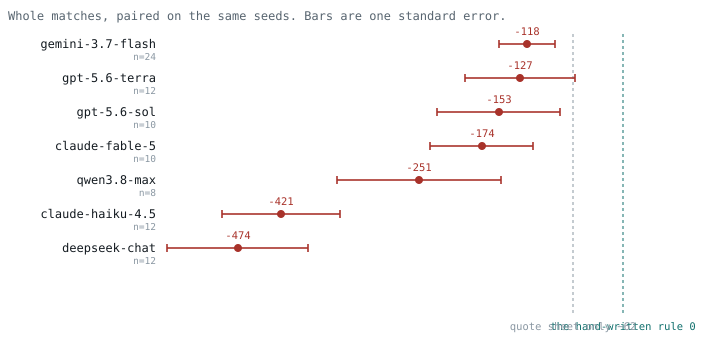
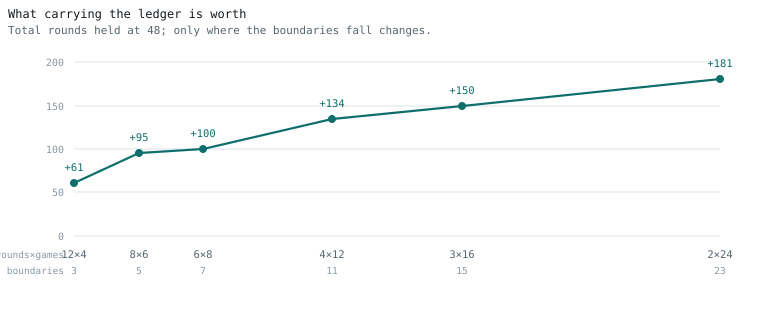
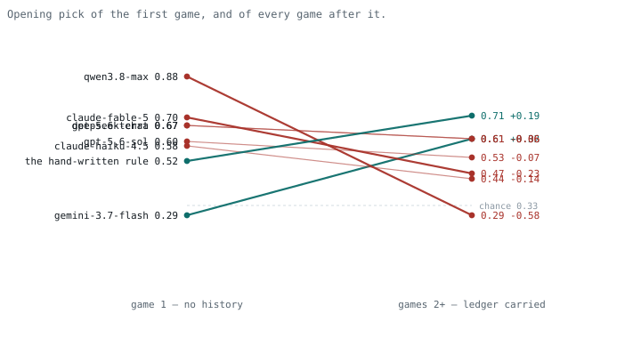

[English](README.md) · **한국어** · [中文](README.zh.md)

# nego-eval

에이전트가 거래 상대를 **직접 고르고**, 그 상대를 **다시 만나는** 협상 환경입니다.

상대를 고를 수 있게 해주는 협상 벤치마크는 세션이 끝나면 기록을 버리고, 기록을
남기는 벤치마크는 상대를 지정해줍니다. 그래서 관계를 이루는 실체 — 내가 고른
누군가와 지난번에 있었던 일 — 는 한 번도 변수였던 적이 없습니다.

여기서는 그게 변수이고, 비트 하나입니다.

|  | 상대를 고르는가 | 게임 간 기억 |
|---|---|---|
| [Cattle Trade](https://arxiv.org/html/2605.14537v1) | 예 | 아니오 |
| [M3-Bench](https://arxiv.org/pdf/2601.08462) | 고정 2자 | 게임 내부만 |
| [RLVR negotiation](https://arxiv.org/abs/2604.09855) | 셀러 1인 | 아니오 |
| [TERMS-Bench](https://arxiv.org/abs/2605.13909) | 지정됨 | 협상 하나 안에서만 |
| **nego-eval** | **예** | **예** |

TERMS-Bench는 아래 숫자들과 나란히 읽을 값어치가 있습니다. 협상 하나 안에서
프런티어 에이전트 13개를 진단하는데, **성사율은 포화되는 반면 잉여 추출에서
갈린다**고 보고합니다 — 집계 결과가 정작 중요한 차이를 가린다는 것이죠. 여기서도
한 층 위에서 같은 일이 벌어집니다. 총이익으로 보면 네 모델이 잡음 안에 붙어 있는데,
관계 잉여 획득률로 보면 25%에서 음수까지 벌어집니다. 그쪽은 상대가 지정되고 지평이
협상 하나이고, 그 안에서 찾아낸 분기를 이 판은 협상들 **사이에서** 찾습니다.

---

## 게임

셀러 셋이 공개적으로 호가합니다. 구매자는 매 라운드 한 개를 삽니다. 납품은 때때로
실패하고, 실패하면 손실 `L`이 생기며 **두 정수가 그 합을 채워야만** 라운드가
결제됩니다.

```
L_구매자 + L_셀러 = L
```

두 쪽은 그 분담을 놓고 최대 세 번 주고받습니다. 끝내 합의하지 못하면 손실은 떨어진
자리에 그대로 — 구매자에게 — 남고, 그 페어는 세 라운드 동안 거래가 정지됩니다. 양쪽
모두 시작 전에 이 사실을 통보받으며, 그게 셀러가 양보할 이유가 됩니다. 모든 금액은
10 단위 격자 위에 있어서 `L = 110`이면 합법적인 분담이 정확히 열두 가지입니다.

**매치**는 같은 셀러 셋과 치르는 12라운드 × 4게임입니다. 조작 변수는 각 게임이
매치의 원장을 들고 시작하느냐, 초면으로 시작하느냐입니다. 시드·캐스트·규칙·길이는
두 조건에서 동일합니다.

### 공시되는 것과 아닌 것

| | 어디에 있나 | 값이 매겨지나 |
|---|---|---|
| 이력 없는 구매자에게 주는 배달률 | 호가판에, 정확히 | 예 |
| 낯선 상대에게 떠안는 손실 비율 | 실패를 겪어야 앎 | 아니오 |
| 단골에게 얼마나 더 떠안는가 | 머물러야 앎 | 아니오 |

공급사의 납기 준수율은 카탈로그에 있고 그 값을 지불합니다. 화물이 망가졌을 때 무엇을
하는지는 카탈로그에 없고, 계약으로 강제되지 않으며, 겪어봐야 압니다. 전부 정수로
세어지므로 보상이 산수입니다 — **루프 어디에도 저지 모델이 없습니다.**

---

## 현실의 무엇에 해당하는가

모든 메커니즘이 구매자가 실제로 하는 일에 대응합니다. 그게 무엇인지 명시할 값어치가
있습니다. 아무것도 닮지 않은 보드게임은 환경이 아니라 퍼즐이니까요.

| 게임에서 | 조달에서 |
|---|---|
| 공시 배달률과, 더 좋은 값에 붙는 더 높은 가격 | 납기 준수율, 품질 인증, SLA 등급 — 공시되고, 그 값을 지불함 |
| 납품 실패 시의 손실 | 결과적 손해: 멈춘 라인, 급송 운임, 일어나지 않은 매출, 재작업 |
| 합이 손실이 되어야 하는 두 정수 | 누군가는 진다. 계약은 결과적 손해에 대체로 침묵하고, 침묵은 그것을 구매자에게 지운다 |
| 분담을 둘러싼 세 번의 교환 | 사고 직후의 통화 — 크레딧 노트, 무상 대체, 운임 분담 |
| 결렬: 구매자가 전부 지고, 페어가 정지 | 합의 실패, 내가 먹고, 다음 RFQ에서 그 공급사를 뺀다 |
| 낯선 상대에게 떠안는 손실 비율 | 카탈로그에 없음. 화물이 망가져 봐야 앎 |
| 단골에게 얼마나 더 떠안는가 | 신규 계정과 10년 계정 사이의, 적히지 않은 차이 |
| 게임을 넘어 이월되는 원장 | 회계연도·계약 갱신·담당자 교체를 넘어 살아남는 구매 이력 |
| 라운드마다 흔들리는 가격 | 스팟 변동. 어떤 주에는 파트너에게 머무는 값이 그 차액이고, 그래서 머무는 것이 결정이 됨 |

표 한가운데의 비대칭이 핵심이고, 제가 만든 게 아닙니다. 공급사가 공시하는 것은 그가
청구하는 가격에 반영돼 있고, 일이 틀어진 뒤에 하는 행동은 공시되지도 계약되지도
않으며 겪어야만 알게 됩니다. 그 간극이
[Brown, Falk & Fehr](https://onlinelibrary.wiley.com/doi/abs/10.1111/j.1468-0262.2004.00511.x)가
실험실에 넣은 것이고 Macchiavello와 Morjaria가 실제 공급망에서 측정한 것입니다. 계약이
닿지 못하는 부분을 다른 무엇도 강제하지 못하기 때문에 그곳에서 관계가 형성됩니다.

### 에이전트에게 "이월 없음"은 가정이 아닙니다

이 조작에는 공급망이 전혀 필요 없는 두 번째 읽기가 있습니다. **새 컨텍스트 창은
이력이 없는 구매자입니다.** 새 세션도, 원장을 떨어뜨린 요약본도, 현재 호가만 돌려주는
도구 호출도 마찬가지입니다. 이 환경이 토글하는 조건은 에이전트 시스템이 기본적으로
놓여 있는 조건이고, 측정하는 것은 그 비용입니다.

### 대응이 깨지는 곳

읽는 사람이 어차피 찾아낼 것들이고, 여기서 먼저 찾는 편이 낫습니다.

- **셀러 3인은 시장이 아닙니다.** 진입도 퇴출도 없고, 좋은 공급사의 관심을 놓고
  구매자끼리 경쟁하지도 않습니다.
- **품목 하나, 라운드당 한 개.** 바스켓도, 리드타임도, 품질 등급도, 최소주문수량도
  없습니다.
- **실패 여부는 바깥에서 정해지고, 그 확률이 공시됩니다.** 현실에서는 둘 다
  아닙니다. 신뢰도는
  공급사를 어떻게 대하느냐에 반응하고, 아무도 그것을 정직하게 공시하지 않습니다.
- **파산이 꺼져 있습니다.** 원가 아래로 압박받은 실제 공급사는 품질을 깎다가
  사라집니다. 그 메커니즘은 이전 판에 있었고 아래에 적은 측정상의 이유로 여기서는
  꺼져 있습니다. 실제 누락입니다.
- **법원도, 보험도, 인코텀즈도 없습니다.** 결과적 손해는 실제 계약에서 **사전에**
  배분되는 경우가 많습니다. 이 판은 그러지 않은 경우입니다.
- **원장이 충분통계가 아닙니다.** 셀러가 얼마나 양보하는지는 구매자가 **최근
  8라운드**에서 차지한 비중에 걸려 있는데, 원장은 누계만 보여줍니다. 원장이
  완전히 같은 두 이력에서 손실 110에 대한 양보가 33만큼 다를 수 있습니다. 여기서
  측정된 모든 에이전트가 같은 조건이었으므로 비교는 성립하지만, 에이전트는 자기가
  일부만 볼 수 있는 메커니즘 위에서 관계를 쌓으라는 요구를 받습니다. 최근 창을
  적는 한 줄이면 닫히는데, 그러면 전부 다시 재야 합니다.
- **언제 끝나는지 알려줍니다.** 에이전트가 남은 라운드 수를 압니다. 끝이 정해지지
  않은 실제 관계에서는 일어나지 않는 방식으로 종반 행동이 날카로워집니다.

---

## 빠른 시작

```bash
pip install -e ".[dev]"
pytest                                   # 불변식 테스트 34개, API 키 불필요

python scripts/run_carry4.py             # 조작 변수, 스크립트 정책
python scripts/run_dp4.py                # 동적계획법으로 구한 정확한 최적
python scripts/train_rl4_shaped.py       # 표 Q학습, 두 가지 보상 설계
```

언어모델 구매자만 키가 필요하고 나머지는 필요 없습니다.

```bash
cp .env.example .env && $EDITOR .env
python scripts/run_probe4.py             # 얼어붙은 위치마다 한 수
python scripts/run_fullplay4.py "[('deepseek/deepseek-chat', 12)]" on
python scripts/run_fullplay4.py "[('deepseek/deepseek-chat', 12)]" off 910012
python scripts/analyse_paired4.py        # 같은 시드에서 모델 대 기준선
```

세 번째 인자가 시작 시드입니다. 이미 값을 치른 매치를 다시 돌리는 대신 이전 실행이
멈춘 곳부터 이어갑니다.

---

## 기준점

`L = 110`, 12라운드 × 4게임, 프리미엄 120에서:

| 정책 | 점수 | 관계 잉여 중 획득 |
|---|---|---|
| 최적, 동적계획법 | **1099** | 100% |
| 이월 없을 때의 최적 | 1031 | 59% |
| 손으로 쓴 규칙, 원장을 읽음 | 996 | 38% |
| 손으로 쓴 규칙, 호가판만 | 934 | 0% |
| 표 Q학습, 잉여 보상 | 898 | — |

그리고 모델들이 매치를 끝까지 두고, 같은 시드에서 그 기준선들과 짝지어진 결과입니다.
0이 손으로 쓴 규칙이고, 모든 모델이 그 왼쪽에 있습니다.

<picture>
  <source media="(prefers-color-scheme: dark)" srcset="docs/models.dark.svg">
  
</picture>

| 모델 | n | 점수 | 규칙 대비 | 호가판만 대비 |
|---|---|---|---|---|
| gpt-5.6-terra | 12 | 958 | −127 ±68 | +6 ±75 |
| gpt-5.6-sol | 10 | 897 | −153 ±75 | −27 ±96 |
| claude-fable-5 | 10 | 876 | −174 ±63 | −48 ±82 |
| gemini-3.7-flash | 24 | 762 | −118 ±35 | −66 ±34 |
| qwen3.8-max | 8 | 786 | −251 ±101 | −190 ±105 |
| claude-haiku-4.5 | 12 | 663 | −421 ±72 | −288 ±79 |
| deepseek-chat | 12 | 610 | −474 ±87 | −342 ±91 |

이 표는 규칙을 두 군데 잘못 말하는 시스템 프롬프트로 측정됐습니다. 배송이
실패하면 구매자가 물건값도 낸다고 했는데 `World` 는 물리지 않고, 판매자가
실패율을 공개하지 않는다고 했는데 바로 다음 메시지가 셋 다 인쇄합니다. 둘 다
`sim/agents.py` 에서 고쳤으므로 오늘 다시 돌리면 이 숫자가 그대로 나오지
않습니다. 모델 하나로 시험한 바로는 그 모순이 첫 라운드 선택을 바꾸지
않았습니다 — 옛 문구 0.88 대 새 문구 0.75, 쌍 비교 −1.3 시그마 — 그러나 물건값에
관한 오기는 48 판 중 7 판에서 기대값이 가장 큰 판매자를 뒤집습니다. 이 표를
근거로 삼기 전에 다시 재는 편이 맞습니다.

짝짓기는 보기보다 중요합니다. 매치 단위 표준편차가 200~600이고, 초기 시드 하나는
아무것도 참조하지 않는 정책에도 +530을 줬습니다. 그러니 다른 시드에서 계산한 기준선
평균과 모델 평균을 비교하면 **어느 판이 뽑혔는지**를 재게 됩니다.

잉여의 분모는 `1099 − 934 = 165`입니다. 원장을 완벽히 읽었을 때의 값이죠. 총이익은 이
환경의 척도로 부적절합니다. 그 85%가 적당한 가격에 사는 데서 나오고, 그건 웬만한
정책이 다 비슷하게 해내기 때문입니다.

**최적은 계산 가능합니다.** 셀러의 양보는 구매자가 최근 8라운드에서 차지한 비중에만
의존하고, 배달률은 공시되며, 가격은 시드마다 고정된 수열입니다. 그래서 상태가
`(라운드, 최근 여덟 수)`이고 가치 반복으로 정확히 풀립니다. 알려진 최고 점수가 아니라
**진짜 천장**을 보고할 수 있는 환경은 드뭅니다.

---

## 계약

세 판이 실패한 뒤에야 하나가 작동했고, 각각 다르게 실패했습니다. 그래서 조건은
모듈입니다 — `nego_eval.game.contract`, 어떤 후보 판에도 걸어볼 수 있고, 전부
지침이 아니라 측정입니다.

| 조건 | 임계값 | 이유 |
|---|---|---|
| 정답이 프롬프트에서 복원됨 | ≥ 0.95 | 아니면 잡음 하의 추정 과제이고, 어떤 점수도 천장에 견줄 수 없음 |
| 호가판만으로는 안 풀림 | ≤ 0.75 | 아니면 원장은 장식 |
| "실패 적은 쪽"이 함정이 아님 | ≥ 0.45 | 평범한 휴리스틱이 우연 점수를 내는 판은 능력이 아니라 저자에 대한 순응을 잼 |
| 어떤 단일 휴리스틱도 충분하지 않음 | ≤ 0.80 | |
| 이름으로 맞힐 수 없음 | ≤ 0.42 | |
| 받아쳐서 얻을 것이 있음 | = 1.00 | 개시 제안이 이미 상한이면 실패할 협상 자체가 없음 |

앞선 세 판은 이 저장소에 **없습니다.** 각각 지금 해당 조건이 담고 있는 이유로
철회됐고, 판 넷을 담은 패키지 — 그중 셋이 틀린 — 는 누군가 잘못된 판 위에 쌓게 만들
뿐입니다. `table4.py`가 그 판입니다. 버려진 것들이 무엇이었고 각각 무엇을 틀렸는지는
`notes/`에 있습니다.

### 체크리스트가 담지 못하는 조건

3번 판은 측정 가능한 조건을 전부 만족하고도 엉뚱한 것을 쟀습니다. 공시 배달률을
정확하게 만드느라 충성도가 배달을 개선하는 채널을 껐고, 흥정 여지를 되살리자 양보
한도의 충성도 항이 구속력을 잃었으며, 그 둘 사이에서 **셀러에게 돌아가는 것이 그
셀러를 더 좋게 만드는 경로가 하나도 남지 않았습니다.** 남은 것은 고정된 숨은 속성과
그것을 알아내는 구매자였습니다. 그러니 원장을 이월하는 것은 시간을 아껴줄 뿐이었고 —
정확히 그것을 측정했습니다.

얼어붙은 위치에서 계산한 어떤 숫자도 이것을 잡지 못합니다. 트랜스크립트를 읽어야
했습니다.

---

## 지금까지 알아낸 것

별도 표기가 없으면 이 판에서 측정한 값입니다. 전체 기록은 `notes/note.html`에 있고,
이전 개정판이 틀렸던 수치 다섯 개도 거기 적혀 있습니다.

**원장을 이월하는 값은 관계를 쌓는 데 걸리는 시간과 그것이 끊기는 시점 사이의
차이입니다.** 총 라운드를 48로 고정하고 경계 위치만 옮기면, 그 값은 4게임에서 +61,
24게임에서 +181로 단조 상승합니다. 기억이 있으면 점수가 평평하고, 없으면 매 게임이
값을 회수할 만큼 자라지 못한 관계를 처음부터 다시 시작합니다.

<picture>
  <source media="(prefers-color-scheme: dark)" srcset="docs/shape.dark.svg">
  
</picture>

**그것을 중심으로 만들어지지 않은 에이전트에게 기록을 건네는 것은 안 건네느니만
못합니다.** 이월 없이 학습한 표 정책에 시험 때 이월된 원장을 주면 첫 수를 0.14의
비율로 맞힙니다. 우연이 0.33인데요. 조회의 3분의 1이 학습에서 가본 적 없는 상태에
떨어지고, 나머지도 방문 중앙값이 178입니다 — 아는 상태의 55,161에 대해서요. 같은
형태가 두 번 더 나타납니다. 계산된 비율을 원장에 덧붙였더니 한 모델이 0.15를 잃고
읽고 있던 열의 사용이 무너졌으며, 아래 일곱 모델 중 여섯이 원장이 생긴 뒤 더 나쁘게
고릅니다.

**보상에서 관계와 무관한 기준선을 빼면 +49의 값어치가 있습니다.** 나머지가 동일한
학습자에게요. 기준선을 빼면 이미 풀린 문제가 차지하던 신호의 85%가 걷힙니다.

**언어모델 일곱이 매치를 끝까지 두었고, 그중 여섯이 원장이 도착한 뒤 더 나쁘게
고릅니다.** 게임 2 이후의 첫 수를 게임 1의 첫 수와 견주면, qwen3.8-max는 0.88 →
0.29로 우연 0.33 아래까지 떨어집니다. 매치당 한 시간을 써서요. claude-fable-5는
0.70 → 0.47, 셋은 조금 떨어집니다. **gemini-3.7-flash만 0.29 → 0.61로 올라가는데**,
읽을 이력이 없을 때는 일곱 중 최악입니다. 손으로 쓴 규칙은 0.52 → 0.71입니다.

<picture>
  <source media="(prefers-color-scheme: dark)" srcset="docs/ledger.dark.svg">
  
</picture>

**모든 모델이 그 규칙에 집니다.** 같은 시드에서 짝지어 118부터 474까지, 최소 두
표준오차로요. 더 약한 기준선 — 원장을 아예 무시하는 정책 — 에 대해서는 하위 둘만
명확히 뒤처지므로, "프런티어 모델이 널 아래 점수를 낸다"는 **이 결과가 보여주는
것이 아닙니다.**

**규모는 아무것도 예측하지 못합니다.** 원장이 도움이 되는 유일한 모델이 flash 등급이고,
측정한 최상위 티어 둘은 중위와 최하위에 있습니다. 한 패밀리에서 세대와 크기가 다른 세
모델이 같은 프로브에서 0.48 / 0.47 / 0.46을 냈습니다.

**모델이 원장 이월에서 무언가를 버는지는 아직 미결입니다.** 한 모델을 35개 공유
시드에서 두 조건 모두 돌렸더니 +40 ±35였습니다. 완벽히 사용하는 정책에 환경이 주는
+64에 대해서요. 둘 다와 양립하고 어느 쪽과도 갈라지지 않습니다. 16쌍에서는 같은
측정이 +88 ±43로 결론이 난 것처럼 보였지만, 아니었습니다.

---

## 이 판으로 학습시키기

판은 `src/nego_eval/rl/` 에 `verifiers` 환경으로 포장돼 있고, `deploy/` 에는
빌린 H100 한 장에서 GRPO를 돌리는 데 필요한 것이 들어 있습니다. 세 번 돌렸고
아무것도 나아지지 않았습니다. 쓸모 있는 부분은 그 이유입니다.

**한 행은 한 턴이지 한 경기가 아닙니다.** 환경은 모델에게 `[system] + 현재
국면`만 건넵니다. 한 경기를 하나의 학습 시퀀스로 이어붙이면 2라운드의 답이
1라운드 텍스트를 참조하게 되는데, 추론할 때는 그 텍스트가 없습니다. 갖지 못할
정보에 기대도록 가르치는 것은 이 판이 재려는 실패 그 자체입니다. 그래서 롤아웃은
앞부분을 고정하고 한 지점에서 `num_generations` 갈래로 나눕니다. 앞부분이 그룹
안에서 공통이므로 GRPO의 그룹 평균이 그 기여분을 정확히 지우고, 경기 전체 보상은
상수만큼 차이 나는 잔여 보상과 같아집니다.

**두 번째 실행은 움직이지 않았고, 움직이지 않은 모양이 미리 적혀 있었습니다.**
고정 시드에서 잰 여덟 점의 추세는 −29.8 ± 24.4 입니다. 아무것도 돌기 전에 써 둔
`scripts/verdict.py` 의 판정 기준 셋 중 둘이 불합격했습니다. 이력이 없는 첫 수의
정확도 `g1` 은 0.375 에서 0.323 으로 떨어졌고, 기록이 도착한 뒤의 이득
`gk − g1` 은 0.080 에서 0.128 로 올랐습니다. 표 학습자 실험이 기록해 둔 종단
보상의 서명이 바로 이 모양이고, 경기 전체 보상은 곧 종단 보상입니다.

**원인은 비율입니다.** `scripts/reward_snr.py` 는 앞부분을 고정하고 각 판매자를
고른 뒤 뒷부분을 끝까지 둡니다. 최선과 최악의 차이를 뒷부분의 표준편차로 나누면
경기 전체는 0.44, 여덟 라운드로 자르면 0.85, 두 라운드면 4.75 입니다. 여덟 개
그룹의 평균 표준오차가 0.35 표준편차이니, 경기 전체 보상은 그룹당 약 1.2 시그마를
줍니다. 여덟 라운드는 게임 경계를 하나 포함하는 가장 짧은 창이고, 이월 효과가
사는 곳이 거기입니다.

**모델이 판을 두고 있지 않았습니다.** 64 토큰 예산에 맞추려고 추론을 껐습니다.
첫 라운드 선택은 이력도 없고 답이 견적서만의 함수인 문제인데, 추론을 끈
Qwen3-8B 는 0.44 를 받습니다. 넘어야 할 선은 0.53 입니다 — 한 판매자 이름만 계속
대도 그만큼 나오기 때문입니다. 추론을 켜면 0.75–0.88 이고, 선택 분포가 이름 편향이
아니라 정답 분포를 닮습니다. 즉 이 실행들은 판의 산술을 할 수단이 없는 모델을
최적화하고 있었고, 그 자리는 `scripts/policy_map.py` 가 독립적으로 짚은
"아무나 고르고 주는 대로 받기" 위입니다.

되돌리는 것은 공짜가 아닙니다. 추론을 켠 결정 하나가 4 천 토큰을 넘고 롤아웃은
서른다섯 결정이니, 추론을 켠 GRPO 는 시간당 요금제 안에서 더 비싼 정도가 아니라
불가능합니다. 이 교환은 여기서 해결하지 않았습니다.

세 실행의 전체 기록과 실행마다 무엇을 바꿨는지, 각 실행이 무엇을 넘어야 했는지는
`deploy/README.md` 에 있습니다.

## 구성

```
src/nego_eval/
  sim/       월드, 협상, 에이전트, 학습된 기준선, LLM 클라이언트
  game/      판, 화폐 격자, 매치 러너, 계약
scripts/     기록에 실린 모든 측정, 하나씩
data/        그 스크립트들이 만든 숫자
tests/       불변식 34개 — 정산 규칙 16, 게임 18
notes/       기록
```

각 모듈의 독스트링은 그 모습이 되기 전에 무엇이 잘못됐는지를 적고 있습니다. 의도한
것입니다. 여기 설계의 대부분은 흉터이고, 흉터가 읽을 값어치가 있는 부분입니다.

---

## 라이선스

[Business Source License 1.1](LICENSE) — source-available이며 OSI 오픈소스가
아닙니다.

**어떤 모델이나 에이전트든 평가하는 것은 자유입니다.** 자기 모델도, 회사 내부에서도,
알아낸 것을 공개하는 것도요. 연구와 교육도 자유입니다. 라이선스가 유보하는 것은
상업적 웨이트를 내보내는 파이프라인에서 학습 환경으로 쓰는 것, 그리고 이것을 제품으로
재판매하는 것입니다.

2030-09-01, 또는 각 버전이 공개된 뒤 4년 중 이른 시점에 Apache 2.0으로 전환됩니다.
허가 범위 밖의 사용은 라이선서에게 문의해 주세요.
